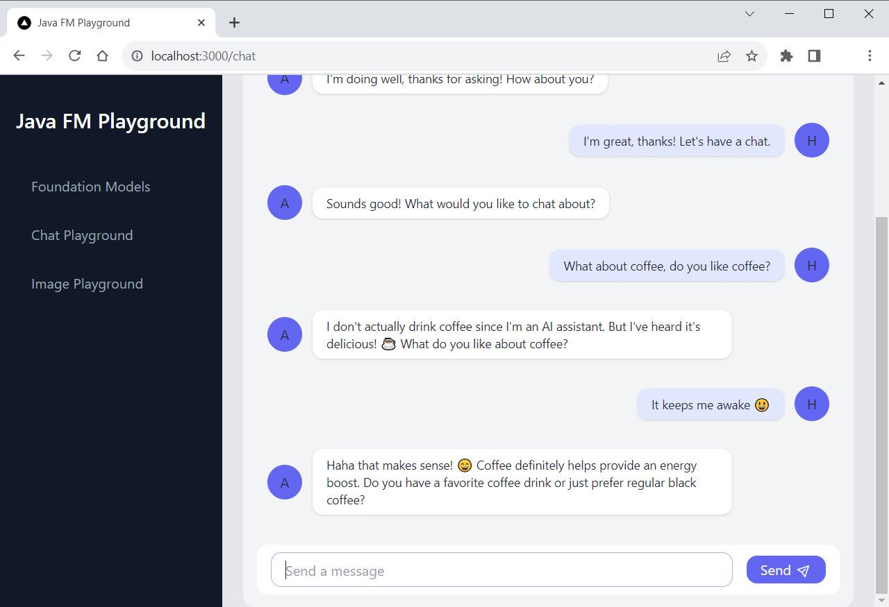

# ☕ Java FM Playground

Welcome to the Java Foundation Model (FM) Playground, a sandbox for exploring Java integration with **Amazon Bedrock**.

> 🚨 **Important:** This application is for educational purposes and not intended for production use.

## Overview

This repository includes a **Spring Boot** application and a **Next.js** frontend, both executable locally. Below is a screenshot of the app in action.



## Prerequisites

Ensure you have the following installed:

- Java JDK 17+ ([Amazon Corretto](https://aws.amazon.com/corretto))
- [Apache Maven](https://maven.apache.org/install.html)
- [Node.js (v18.17+)](https://docs.npmjs.com/downloading-and-installing-node-js-and-npm) with npm (for Next.js frontend)
- Configured [AWS account](https://aws.amazon.com/free/) with permissions to access Amazon Bedrock
- To use Bedrock, you must [enable access](https://docs.aws.amazon.com/bedrock/latest/userguide/model-access.html#add-model-access) to at least the following models in `us-east-1`: 
  1. Anthropic: Claude
  2. Stability AI: Stable Diffusion XL

## Running the Application

Ensure prerequisites are met, then proceed with the following steps:

### Clone the repository

Open a terminal, navigate to a directory of your choice, and execute the following command:

```shell
git clone https://github.com/build-on-aws/java-fm-playground.git
```

### Backend Setup

In the java-fm-playground/backend directory, run:

```shell
mvn spring-boot:run
```

> 🛠 The backend runs on port 55500 by default. See troubleshooting for port changes.

### Frontent Setup

In a new terminal window, within java-fm-playground/frontend, execute:

```shell
npm run dev
```

> 🛠 the frontend serves on port 3000 by default. See below for port changes.

## Accessing the Application

Open `http://localhost:3000` in your web browser to interact with the application.

## Stopping the Application

To halt the application, you will need to stop both the backend and frontend processes.

### Stopping the Frontend

In the terminal where the frontend is running, press `Ctrl + C` to terminate the process.

### Stopping the Backend

Similarly, in the backend terminal, use the `Ctrl + C` shortcut to stop the server.

If you encounter any issues, you can forcefully terminate the processes by finding the process ID (`PID`) and using the `kill` command on Unix-based systems or Task Manager on Windows.


## Using Different Ports

Change the backend port in the following files:
- `backend/src/main/resources/application.yml`
- `frontend/app/app.config.js`

To run the frontend on a different port:

```shell
npm run dev -- --port NEW_PORT
```

## License

This library is licensed under the MIT-0 License. See the [LICENSE](LICENSE) file.

## Security

See [CONTRIBUTING](CONTRIBUTING.md#security-issue-notifications) for more information.
