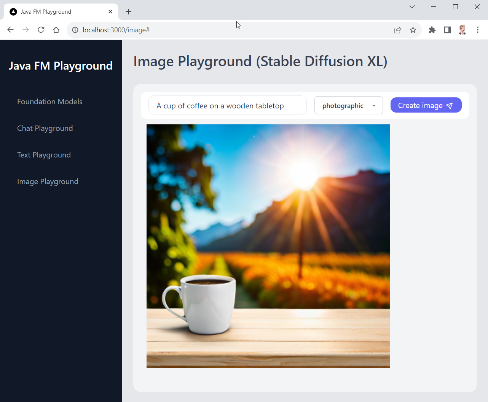

# ☕ Java FM Playground

Welcome to the Java Foundation Model (FM) Playground, a sandbox for exploring Java integration with **Amazon Bedrock**.

> 🚨 **Important:** This application is for educational purposes and not intended for production use.

## Overview

This repository includes a **Spring Boot** application and a **Next.js** frontend, both executable locally. Below is a screenshot of the app in action.



## ⚠ Important

- Running this application might result in charges to your AWS account. For more details, see [Amazon Bedrock Pricing](https://aws.amazon.com/bedrock/pricing/).
- This app is configured to run in `us-east-1` and has not been tested in every AWS Region. For more information see [AWS Regional Services](https://aws.amazon.com/about-aws/global-infrastructure/regional-product-services).
- We recommend that you grant your code least privilege, i.e. only the minimum permissions required by the application. You can find an IAM Policy document with the required permissions in this repository at `resources/bedrock-access-policy.json` ([display policy](./resources/bedrock-access-policy.json)).

## Prerequisites

Ensure you have the following installed:

- Java JDK 17+ (e.g. [Amazon Corretto](https://aws.amazon.com/corretto), a free distro of the JDK)
- [Apache Maven](https://maven.apache.org/install.html) for the backend server
- [Node.js (v18.17+)](https://docs.npmjs.com/downloading-and-installing-node-js-and-npm) for the frontend application
- You must have an [AWS account](https://aws.amazon.com/free/), and have your default credentials and AWS Region configured as described in the [AWS Tools and SDKs Shared Configuration and Credentials Reference Guide](https://docs.aws.amazon.com/credref/latest/refdocs/creds-config-files.html).
- You must request access to the models before you can use them. For more information, see [Model access](https://docs.aws.amazon.com/bedrock/latest/userguide/model-access.html). To run the app, you need access to the following models in `us-east-1`:
  - Anthropic Claude
  - AI21 Labs Jurassic-2 Mid
  - Stability AI Stable Diffusion XL

## Running the Application

After verifying the prerequisites, follow these steps:

### Clone the repository

Open a terminal, navigate to a directory of your choice, and execute the following command:

```shell
git clone https://github.com/build-on-aws/java-fm-playground.git
```

### Backend Setup

In the `java-fm-playground/backend` directory, run:

```shell
mvn spring-boot:run
```

Once the server is running, you will see the following output:

```shell
...
2023-11-13T14:19:02.862+01:00  INFO 34848 --- [main] o.s.b.w.embedded.tomcat.TomcatWebServer  : Tomcat started on port(s): 55500 (http) with context path ''
2023-11-13T14:19:02.868+01:00  INFO 34848 --- [main] a.c.e.b.SpringFmPlaygroundApplication    : Started SpringFmPlaygroundApplication in 1.415 seconds (process running for 1.659)
```

> 🛠 The backend runs on port 55500 by default. See below for port changes.

### Frontend Setup

In a **new terminal window**, navigate to the `frontend` directory and install the packages required by running the following command:

```shell
npm install
```

After successful installation you can start the frontend application by executing the following command:

```shell
npm run dev
```

When the application is running, you will see the following output:

```shell
> frontend@0.1.0 dev
> next dev

   ▲ Next.js 14.0.0
   - Local:        http://localhost:3000

 ✓ Ready in 3.3s
```

## Accessing the Application

Open `http://localhost:3000` in your web browser to interact with the application.

## Stopping the Application

To halt the application, you will need to stop both the backend and frontend processes.

### Stopping the Frontend

In the terminal where the frontend is running, press `Ctrl + C` to terminate the process.

### Stopping the Backend

Similarly, in the backend terminal, use the `Ctrl + C` shortcut to stop the server.

If you encounter any issues, you can forcefully terminate the processes by finding the process ID (`PID`) and using the `kill` command on Unix-based systems or Task Manager on Windows.


## Using Different Ports

Change the backend port in the following files:
- `backend/src/main/resources/application.yml`
- `frontend/app/app.config.js`

To run the frontend on a different port:

```shell
npm run dev -- --port NEW_PORT
```

## Troubleshooting

The AWS Region is hard-coded in the application. However, if your local `AWS_REGION` environment variable is set to a different region, the application may fail. In this case, please make sure to either unset `AWS_REGION`, or set it to `us-east-1`.

## License

This library is licensed under the MIT-0 License. See the [LICENSE](LICENSE) file.

## Security

See [CONTRIBUTING](CONTRIBUTING.md#security-issue-notifications) for more information.
